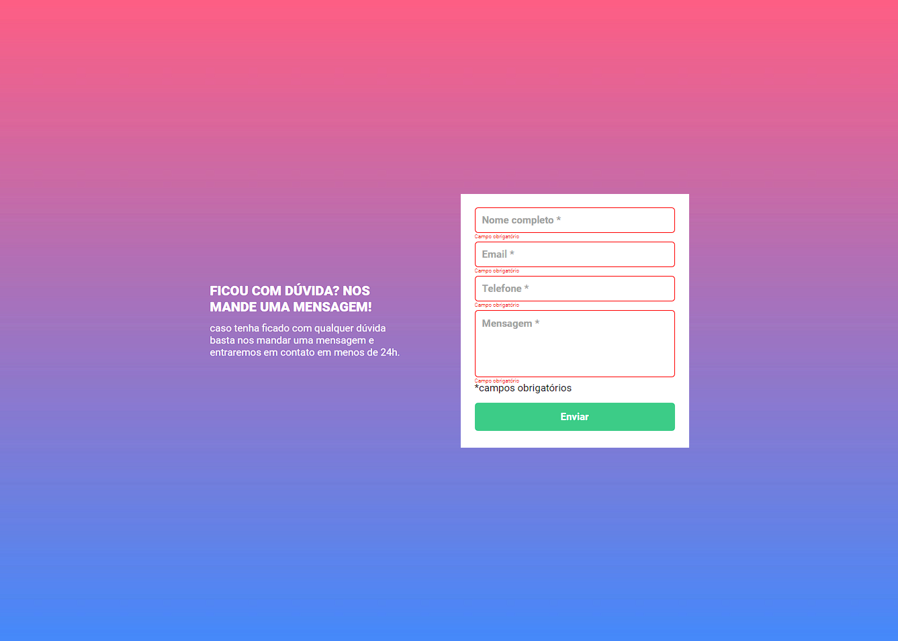
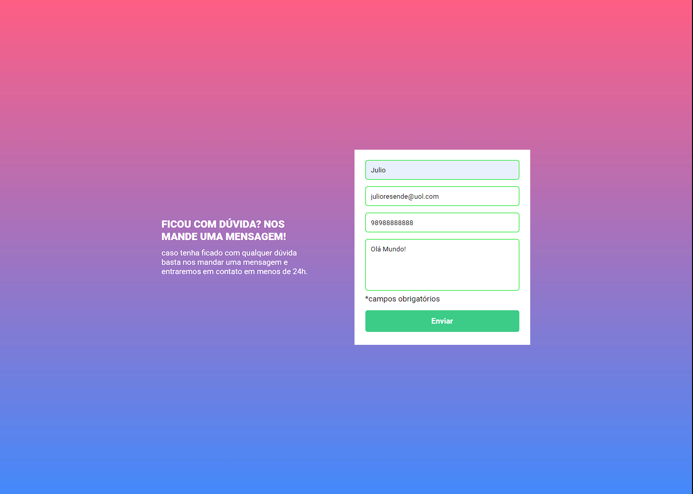

## Exercício de JavaScript Intermediário - Formulário com validação

Quest para o curso de programação do DevQuest, no módulo de JavaScript Intermediário.

## O desafio:

Criar um formulário de validação;

## Pontos Importantes:

A validação do formulário deve ser feita com javascript puro.
Ao clicar para enviar o formulário, se caso algum campo não estiver preenchido, a borda do input deve ficar vermelha e uma mensagem de "campo obrigatório" deve aparecer embaixo do campo que não foi preenchido, conforme o figma.
O fundo do formulário deve ser feito usando a imagem em anexo na aula.

## PRINTS:

# Formulário:

# Formulário não preenchido:

# Formulário preenchido:

## Links:

- Repositorio URL: [Formulario-com-validacao](https://github.com/julioresende77/formulario-com-validacao)
- Site URL: [Formulario-com-validacao](https://julioresende77.github.io/formulario-com-validacao/)

## Author:
- GitHub - [Júlio Resende Dev](https://github.com/julioresende77)
- Twitter - [@ResendeDev](https://twitter.com/ResendeDev)